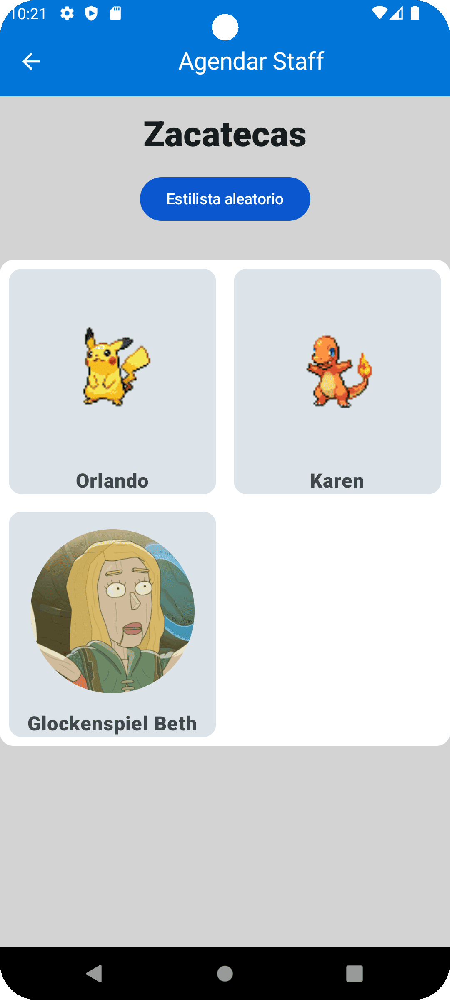
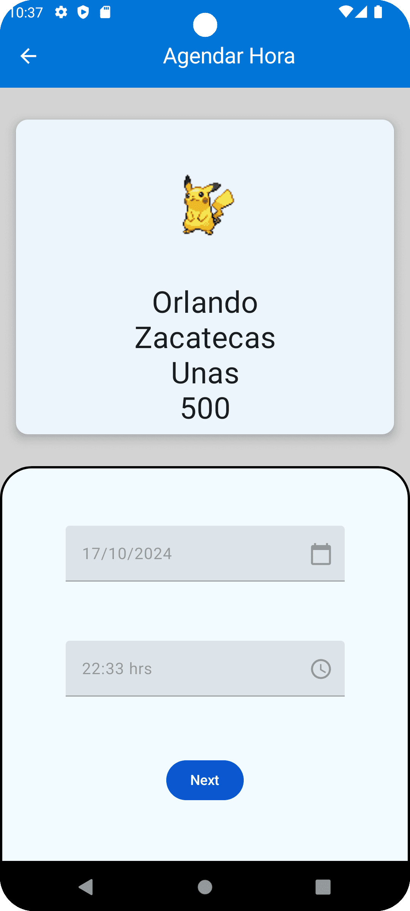

# Skeduly

Proyecto realizado por Guadalupe, Karen , Rebeca y Ailil  Estudiantes de Bedu , este proyecto es para el modulo de kotlin intermedio.

El objetivo principal de la app es la gestión de citas enfocado a establecimientos de belleza, como barberías y estéticas. También se incluyen algunas otras funciones para brindarle al usuario un mejor servicio, tales como información adicional sobre el establecimiento (servicios, ubicación, sucursales, staff) y una pequeña sección de e-commerce con productos que el establecimiento tenga a la venta.

- credenciales 
- admin@gmail.com 
- admin

-usuario@gmail.com
-usuario1234

-root@gmail.com
-root1234

## Features

- MVVM Arquitecture
- Navigation Componet
- Fragments
- RecyclerView
- Control de versiones GIT
- Kotlin
- Maquetacion con uso de ConstrintLayout
- Material Design
- ViewBinding
- Retrofit
- Trancitions entre fragments
- Single Activity
- Room Database
- Dagger Hilt
- Corutinas

 <table>
  <tr>
    <td><strong>Login</strong></td>
    <td><strong>Home</strong></td>
    <td><strong>Sucursal</strong></td>
    <td><strong>Staff</strong></td>
  </tr>
  <tr>
    <td></td>
    <td></td>
    <td></td>
    <td></td>
  </tr>
  <tr>
    <td><strong>Servicio</strong></td>
    <td><strong>Fecha</strong></td>
    <td><strong>Hora</strong></td>
    <td><strong>Cita agendada</strong></td>
  </tr>
  <tr>
    <td></td>
    <td></td>
    <td></td>
    <td></td>
  </tr>
</table> 

