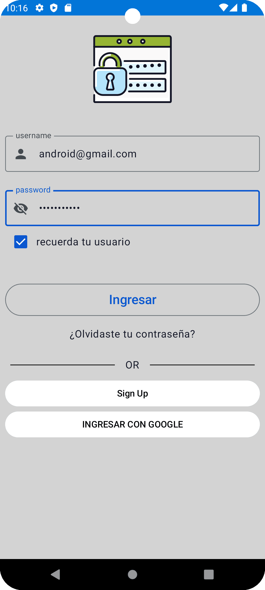
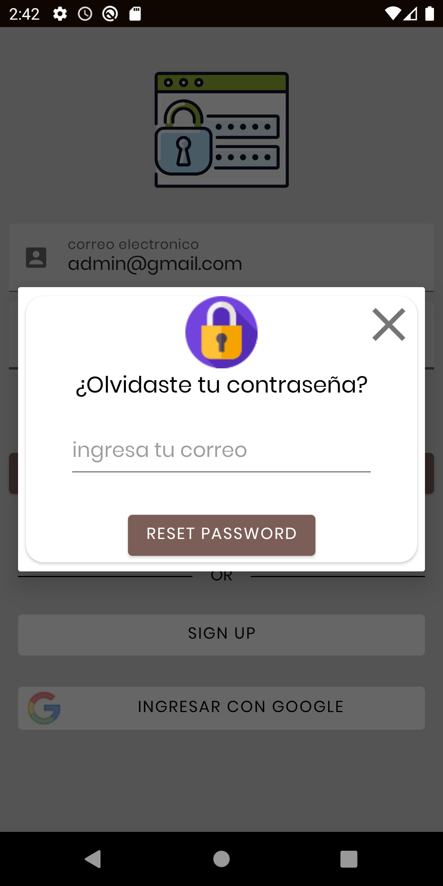
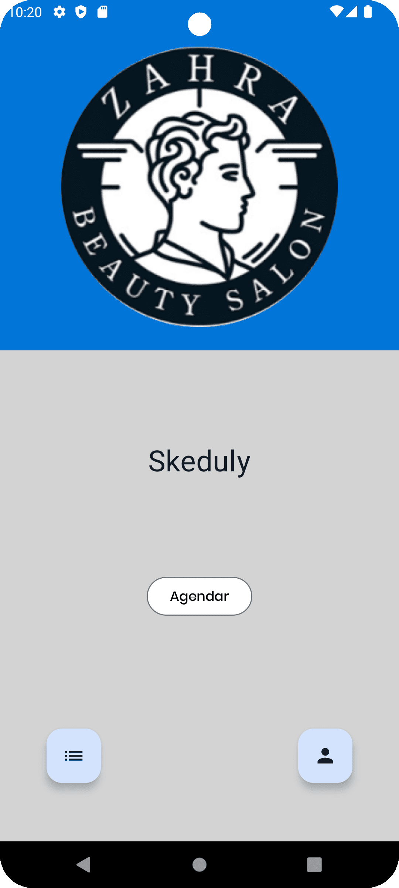
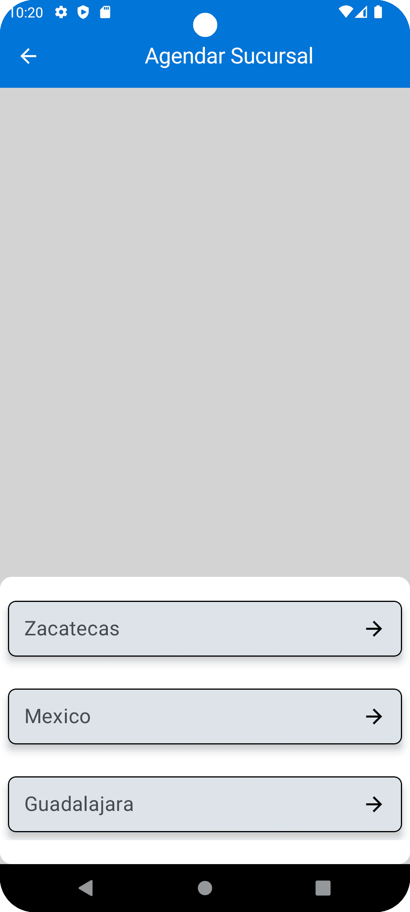
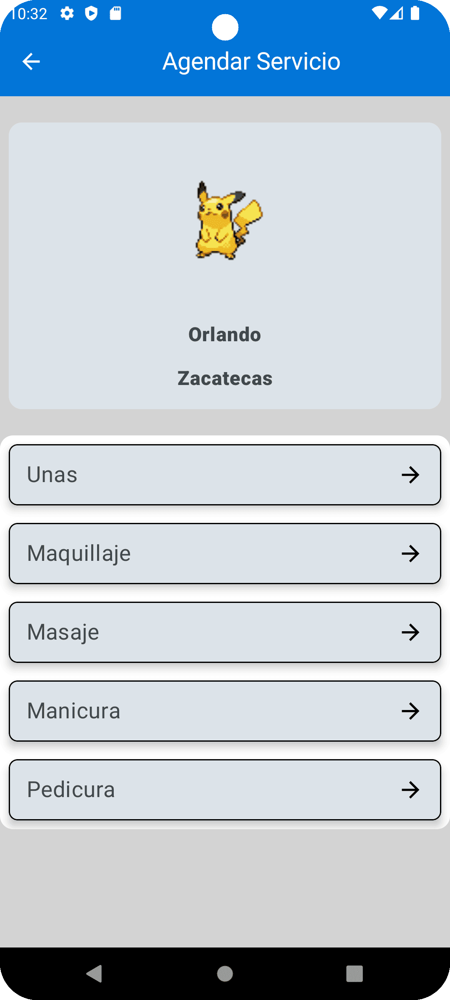
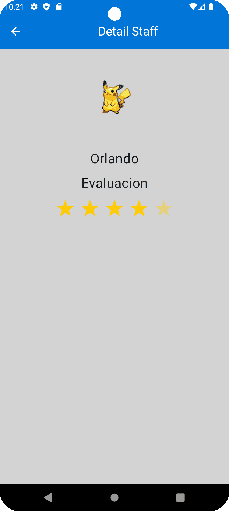
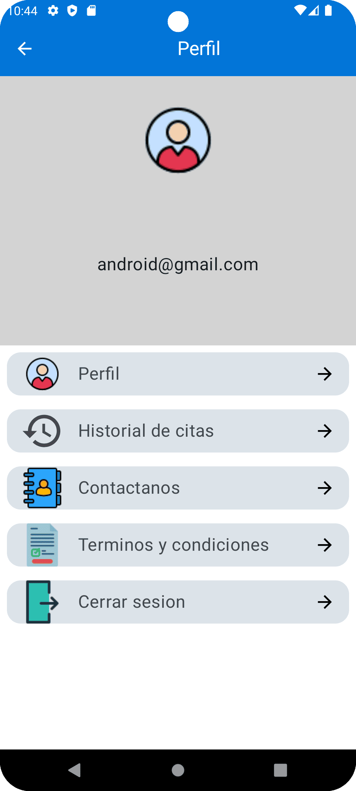
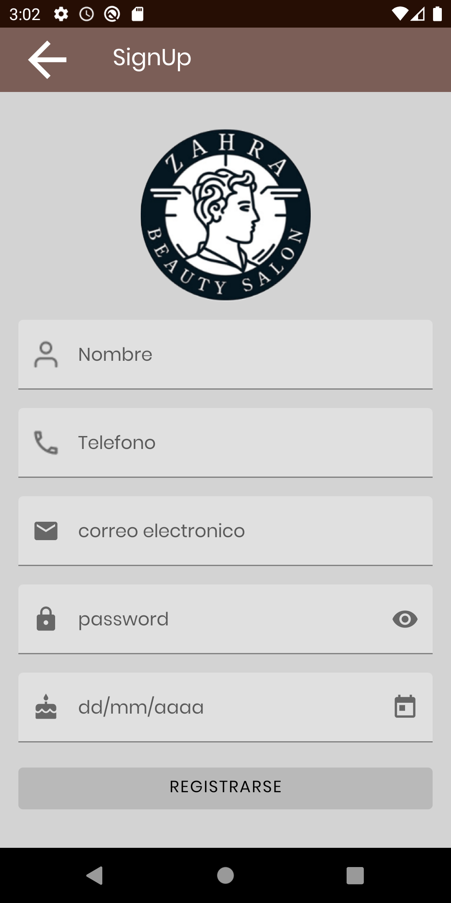

# Skeduly

Proyecto realizado por Guadalupe, Karen , Rebeca y Ailil  Estudiantes de Bedu , este proyecto es para el modulo de kotlin intermedio.

El objetivo principal de la app es la gestión de citas enfocado a establecimientos de belleza, como barberías y estéticas. También se incluyen algunas otras funciones para brindarle al usuario un mejor servicio, tales como información adicional sobre el establecimiento (servicios, ubicación, sucursales, staff) y una pequeña sección de e-commerce con productos que el establecimiento tenga a la venta.

- credenciales 

- admin@gmail.com 
- admin1234

- usuario@gmail.com
- usuario1234

- root@gmail.com
- root1234

## Features
- Single-Activity Arquitecture
- Android Jetpack (MVVM Arquitecture ,Navigation Component,DataBinding,ViewBinding,Fragments,Dagger Hilt,Room Database,Componentes Material Design) 
- RecyclerView
- Control de versiones GIT
- Kotlin
- Maquetacion con uso de ConstrintLayout
- FirebaseAutentication
- Retrofit
- Trancitions entre fragments
- Lottie (Animaciones)
- Corutinas
- Dark theme

  [Video](https://www.youtube.com/watch?v=NiYT53pavk4)

 <table>
  <tr>
    <td><strong>Login</strong></td>
   <td><strong>Login Forget</strong></td>
    <td><strong>Home</strong></td>
    <td><strong>Sucursal</strong></td>
  </tr>
  <tr>
    <td></td>
    <td></td>
    <td></td>
    <td></td>
  </tr>
  <tr>
    <td><strong>Servicio</strong></td>
    <td><strong>Fecha</strong></td>
    <td><strong>Detalle</strong></td>
    <td><strong>Staff</strong></td>
  </tr>
  <tr>
    <td></td>
    <td></td>
    <td></td>
    <td></td>
  </tr>
 <tr>
    <td><strong>perfil</strong></td>
    <td><strong>Sign up</strong></td>
  <td><strong>Cita Agendada</strong></td>
  </tr>
  <tr>
    <td></td>
    <td></td>
   <td></td>
  </tr>
</table> 

